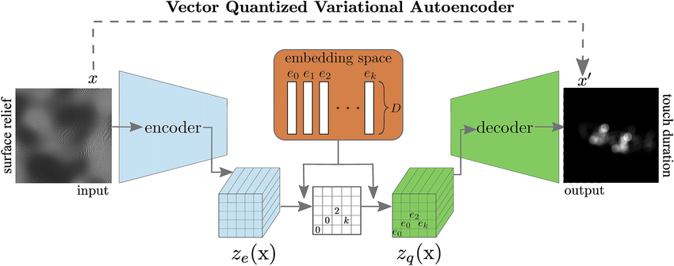

# Paper Implementation of VQ-VAE

## Description
This repository contains the implementation of the VQ-VAE (Vector Quantized Variational Autoencoder) model. VQ-VAE is a powerful generative model that combines the strengths of variational autoencoders and vector quantization. It is particularly effective for tasks such as image generation and compression.

For more details, you can refer to the original paper: [Neural Discrete Representation Learning](https://arxiv.org/abs/1711.00937).

### What is VQ-VAE?!


VQ-VAE is a type of autoencoder that uses vector quantization to map continuous latent representations to discrete codes. This allows the model to learn a discrete latent space, which can be beneficial for various downstream tasks.

### Why is it better?
VQ-VAE addresses some of the limitations of traditional VAEs by using discrete latent variables, which can lead to better generative performance and more interpretable latent representations.

### How it works
1. **Encoder**: Maps the input data to a continuous latent space.
2. **Vector Quantization**: Discretizes the continuous latent representations into a finite set of codes.
3. **Decoder**: Reconstructs the input data from the discrete codes.

### how to train 

```
#clone this 
$ git clone <clone link>
```
```
# install package 
$ pip install . 
```
```
# cd into component 
$ cd src/VQvae/components
# run 
$ python trainer.py
```


## Dataset Overview
Provide an overview of the dataset used for training and evaluation. Include details such as the source of the dataset, the number of samples, and any preprocessing steps.

## Results
Summarize the results obtained from the implementation. Include metrics such as reconstruction error, sample images, and any other relevant performance indicators.

## Deployment
Explain how to deploy the model for inference. Include instructions for setting up the environment, loading the trained model, and running inference on new data.